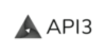

# Harmony Hackathon: Terra Challenge: Mirror Protocol 

Youtube Demo - https://www.youtube.com/watch?v=VWB0XglZp-o (Not up-to-date)

1. [ Challenge Explanation ](#desc)
2. [ Demos ](#demos) 
3. [ State of Data Feeds for Mirror DApp ](#datafeeds) 
4. [ Problems ](#problems)  
5. [ Soltion No. 1 ](#solno1) 
6. [ Solution No. 2 ](#solno2) 
7. [ Decentralized Infrastructure ](#deinfra)  
8. [ Mirror Web dApp (Terra) UI Front-End (GUIDE) ](#dappguide)   
9. [ Mirror Web dApp (Terra) UI Back-End ](#dappbackendguide) 
10. [ Sources and resources ](#sources)


[![Add to Homescreen](https://img.shields.io/badge/Skynet-Add%20To%20Homescreen-00c65e?style=for-the-badge&labelColor=0d0d0d&logo=data:image/png;base64,iVBORw0KGgoAAAANSUhEUgAAACAAAAAbCAYAAAAdx42aAAAABGdBTUEAALGPC/xhBQAAACBjSFJNAAB6JgAAgIQAAPoAAACA6AAAdTAAAOpgAAA6mAAAF3CculE8AAAAeGVYSWZNTQAqAAAACAAFARIAAwAAAAEAAQAAARoABQAAAAEAAABKARsABQAAAAEAAABSASgAAwAAAAEAAgAAh2kABAAAAAEAAABaAAAAAAAAAEgAAAABAAAASAAAAAEAAqACAAQAAAABAAAAIKADAAQAAAABAAAAGwAAAADGhQ7VAAAACXBIWXMAAAsTAAALEwEAmpwYAAACZmlUWHRYTUw6Y29tLmFkb2JlLnhtcAAAAAAAPHg6eG1wbWV0YSB4bWxuczp4PSJhZG9iZTpuczptZXRhLyIgeDp4bXB0az0iWE1QIENvcmUgNi4wLjAiPgogICA8cmRmOlJERiB4bWxuczpyZGY9Imh0dHA6Ly93d3cudzMub3JnLzE5OTkvMDIvMjItcmRmLXN5bnRheC1ucyMiPgogICAgICA8cmRmOkRlc2NyaXB0aW9uIHJkZjphYm91dD0iIgogICAgICAgICAgICB4bWxuczp0aWZmPSJodHRwOi8vbnMuYWRvYmUuY29tL3RpZmYvMS4wLyIKICAgICAgICAgICAgeG1sbnM6ZXhpZj0iaHR0cDovL25zLmFkb2JlLmNvbS9leGlmLzEuMC8iPgogICAgICAgICA8dGlmZjpPcmllbnRhdGlvbj4xPC90aWZmOk9yaWVudGF0aW9uPgogICAgICAgICA8dGlmZjpSZXNvbHV0aW9uVW5pdD4yPC90aWZmOlJlc29sdXRpb25Vbml0PgogICAgICAgICA8ZXhpZjpQaXhlbFlEaW1lbnNpb24+NTM8L2V4aWY6UGl4ZWxZRGltZW5zaW9uPgogICAgICAgICA8ZXhpZjpQaXhlbFhEaW1lbnNpb24+NjQ8L2V4aWY6UGl4ZWxYRGltZW5zaW9uPgogICAgICAgICA8ZXhpZjpDb2xvclNwYWNlPjE8L2V4aWY6Q29sb3JTcGFjZT4KICAgICAgPC9yZGY6RGVzY3JpcHRpb24+CiAgIDwvcmRmOlJERj4KPC94OnhtcG1ldGE+Cnr0gvYAAAe5SURBVEgNlVYJbFzVFT3vL/Nt4yXOyiLahF24EMBrszqhNA1EpZWwK0qxZ2xk0apEpaJFNGkzRCC1VYlUJyoisj22EyrFlqBqaGgqiE0QxPaMSyi1E9JS0pRCwGRx7Njz5289702+lWArSZ8zkz/vv3vvufeee+8T+H9WT7WBVb2uEknVXw9XrENEWw6Bm5Hxr4bnz4IuxmHqHwHBu3D81xGYr6Cq5VMlE9ToEN3e+SbF+T8u+hwKD8SuhQjigKhFrp5Pw0CGOv0gAP9xX0CjWksHDA2wvc+51YqM+DWWtJ7E+U7I0xc1Gr4M4hpE3Ed//YPQtW3IMWZjNB1Q2oFpRJBDYz6Nu/zQJqMASD8nM9zgc5ElMOkeg+83oKLjdXQxErXZSFwaQHj4YOPj9GwLJh0a8tPINXMUviA4oEJtiEMQ+klGJwLH/RI0vZJpWAvLmIMztouIbihgtvcQlnT+PoxEFoD0RUDG78IVhivZ0Mhwt1AR403fCiIm0m4/Q76BHu3j3nRZqSn1vavgG+uZgifID4NR8glEYyRWUm6/jIRAqslE2Xa6xRV6K5/DsA/W3U6yDcILDBp0kR8x+LwVd7Wtl8doWmB7k4HiUz5qSgJ0DwnMKxGoHuKbc4RLNi6F8F8iiPmKH0I7gv9+Xob7/zgmsD82DznBQljeMBbvOKsMK82bqEAESEX3wtC/jnHHRlHEgu1uRVl71ngYIXV+hq8gEOiuNZnvDAaidzAFPSRlIQotjcR9ik78MpuCA9GFCLz76OFRLN35pylVAw21mGPtwvGzDolm0ts3UZZYwfcC8bj8yJRceg3VRFBCEIP1teTGLoIgWcW/6PTtmgrhV9uP4vSsFu7eTI8T6G8oU1p97Q2cSD8Pk9S2DJBcP1H7PXH9so1LAWlcRqu0o4uVsluVqCauQ8ZcwfIihDjL7N6tNpZ2biGIVkTwG7z7SAtOjzqoSPwAgbYEZzMbsff6pAKwKu4q4JInX1xyT/Lii2tkXpaoQmxjFYHNiqXrr7zwYE+cnY7KJaD7jz1PDnwHrtfMnP9C6ZOE9dKLyDwHlTs+nLLxdk0uNFZG1Ytnpvakjk0kJEhM2UPClWrKg595B3nGTeTBngsByEPZSpACAQZja5jubnLDIYN/isqOVqWnr24V336FzD6Mqp2vqbPJhuvgubfxnAthfIAl7YfV2fBLpqDgJqEq7q+xbvaRBzDhvjcdQFZAYKB+tepa8vdAbDfm563DyMQ7BLQB5W2vYs9DhZhtNDHY5eyOvTjhdmINq+jtugpKrCPARcg1jpBw+5Be1K8im9UNHKhrRlHOYzjr/Gc6gLDnpxq6oAUlmPDWYlnnMSSjD1O+g4ICo5k/09OnUdXeh75HFsDyfw5NW8Gg7YPjbEEZz8vyzvPr2Kq/hUAUM4ocTu4eHJ14CVfnbsZs6wmMOZ9OJ1HvSBZUxv2Yxm6Fpb2HwWgU5e07kPZvYTfsxdycb7CmDzAyu9iXC3Fn2w8Zzm8yOtfAMI8gFduPPHEnyjqew+LW5UhnHoXGP1NvxQ0FJ6HjUYxleDzInQ4A1dlAaeIjjPNQxs9HXiSBVP19WN55BK98eA9GJjdJirAx1VLZQRr8HTR/DItbamAHlaqBFUX2EuBxDrANnB+HCeRBfPJJEUn9JIF8QA5wWupD0wGMsIXKZRp/Z8uVdhwOGzkB7lb760ikisRmpmA1vTjEPOexT3wfuv4+gTwN3RhGadtKgvwafT6OK/OfQYH1GYF048r5y8grVlXiDtiZSkxMPDADB0gr2Rteq5uDIobfC66iR3LE/hunxhfjnu7RqflxuKEAY8E2vqtTtS3vABmflxH8CuWJbQpwdoRvxtzcG9jOOaKdvzH2L+L0+AtS13QAUiocSslYG1twjKTLzoG0sxHlHc8qAKUcPlPDRhG0me11lmqzBREg7R1C4MfpcZcCkow9TiI+ieKcBeoCM+mO8vzamQGEkzApS0rrYwpkWjSOUpvEqUYp2d/F/j5c4qpmI4H0P7yIfZ6AjWqmxuFtyOQzb0TuW5Ql8PZe9NTkoyB/E9PXhOLcQpxxvj0zAAk5LMdktAV5ZiNO2TYrwmJyPuPbNahoP6giVcNfg8Xa1EgfjP6MZfesVEHjLgksx7jk0h/geRsZkSH2mBL4uAZVHX+5CIBzXHjzu8W4Iqef6m7ktYogdItvTpOUj5GMO5Uh+RXOBdl2+6JVvKw2M9Tl9JadUWi4ghPNkawWz5GE2aEmB/6UgpkeQi6kordRUIaygDm2YQgrG16vl95uh+30Yp99AnFOvea1Fta/arONrybIXRw4c7MXVsjbtIlii/xwS3BXYljOnIsDkKDCATUQLWded9P4AvaHDA0LemUyGlLhKY7rf9AYicXce/5CVs+1NCzUJwg8Es5gY5NV8FuUJn7ElKhquzSA80G81fhltt0EvV/F/Eqms66YYCEiasbzuqfyLfuG4/OLd0BpOJ9VYXsTVPUUw98sVXJJ20R4uSskpTwvL6mB/2M2oFvP3f1p0KM6Bl36pTHn8gIjAaUdXvOCl8mHZ7Bs5/tZrsSl/7KyFAr5/+UtRbRzwnuY63kLZHe8lyAq6PFCNqM5LFabrfZjah7mXg8MYzdKW/+pDMxwh/wf4xZoOPPcKX0AAAAASUVORK5CYII=)](https://homeapp.hns.siasky.net/#/skylink/AQC2TDP2zSLBzMXFWg2FYYpXfUizHrIzg0S4pn6l-2TLfg)  

<a name="desc"></a>
## Decentralized Asset Management.

Over 20% of users of Mirror are in Thailand. Interact with Terra.js, Mirror.js to build decentralized front ends for Mirror. This is a core priority for TFL to enable censorship resistant asset management across borders.

***Keywords:***

Asset Management, Censorship-resistance, Cross-porders, Tefi, Defi, Decentralization, Scalability and Speed (Super important for Real-World Assets)

## Host Mirror's User Interface Front-End On Skynet

<a name="demos"></a>
#### Working Demo:

1. [x] Hosting Mirror web-dapp  | https://2009tnf1ojqq6b5fj5q72je656scv3j06bf5tjms9h48krvfk3fbqo0.siasky.net/#/trade | [Github](https://github.com/amrosaeed/Skynet-Hackathon)
2. [x] Hosting eth-web-app | https://100aq6vcvfedpdtaqkfdp8unjm4cs6p4153ikbnvsjd3sd1dtipeg5g.siasky.net/#/ | [Github](https://github.com/amrosaeed/eth-web-app)
3. [x] Hosting Terra-Station | https://1001masu2en7jc3d09uurtn0qdi82unsi3ok19cuehorg9veulubkq8.siasky.net/ | [Github](https://github.com/amrosaeed/terra-station)

### Terra station wallet | Mirror mobile wallet
1. [x] Currently its possible that Ledger device will connect to [Terra-Station](https://1001masu2en7jc3d09uurtn0qdi82unsi3ok19cuehorg9veulubkq8.siasky.net/) ***Built on Skynet***.
2. [ ] We've been searching the possiblity of creating a distributed and censorship-free permissionless store for browser extension on Fluence network like terra-station, as unfortunately  there will be always the possiblity of chrome browser remove the extension out of its store.
3. [ ] We also looked at integrating mAssets to MASK network allowing sending,recieving and trading over web2 social networks like twitter but unfortunately we cut short on time.
4. [ ] We also looked at integrating Terra-Swap with Homescreen but unfortunately we cut short on time.
## Host Mirror's User Interface Back-End On Akash
<a name="datafeeds"></a>
***State of data feeds for Mirror-web-dapp:***

#### Band protocol (role):

There are oracle contracts for each mAsset. These assets use band protocol, which take feeds from a pre-whitelisted feeder.
So band has their oracle state, Terra just has a relayer as a contract implemented on Terra.
Technically, decentralizing mirror webapp has nothing to do with the oracle feed, however, the inner workings are decentralized ***(but not ideal setup for preventing front running)*** . Since the price feed is from band, if you run your clock around Band faster than the relayer you can front run Mirror users.

 
#### Mirror-graph:

***Solution immplemented (Mirror-web-app) to add much more functionality (Complex-queries) is to use GraphQl server (Mirror Graph)***

Mirror itself can run without the graphql backend though. The graphql backend is there to provide historical data. Alot of business logic is still functional without it but not all  business logic relies on historical data, it acts as a single point of failure and changes to APIs can break old builds to Homescreen.

#### Mantle:

***Solution immplemented (Mirror-web-dApp) with an ultimate goal of indexing the whole Blockchain .***

Mirror-web-dapp relies on mantle. It s just a state reader interface, meant to used to index the chain, but also hosted on a centralized server as a blockchain SaaS.

If you query to lcd, you send a query msg to some nodes. But if you query to lcd, the msg send to the mantle server, lcd and mantle do almost the same thing. Mantle is only for the get msg


## Current state of price feed to mAssets smart contracts Vs dAPIs solution:


***Figure 1: Decentralized interoperability solutions employ third-party oracles that do not
natively reveal their sources. dAPIs are composed of first-party oracles, meaning that API
providers operate their own Airnodes. In addition, dAPIs are decentralized in how they are
governed, resulting in end-to-end decentralization.***

### TFL Aggregator

Mantle & GraphQl servers runs by TFL as API entry point for mAssets smart contracts, although TFL is transparent (open source code) but eventually these solutions suffers from drwabacks regrads decentralization, governance, and intrinsically cost effeciency. 

- @ "https://mantle.terra.dev/" 
- @ "https://graph.mirror.finance/graphql" 

***e.g. If a decentralized oracle network is configurable by a centralized entity, its governance is centralized. This may cause governance mistakes to go unnoticed, which may result in the data feeds misreporting even when the underlying APIs and ora-
cles are functioning correctly.***
<a name="problems"></a>
#### ***Problems***

- An intermediate layer of insecure and expensive third-party oracles
- Decentralized interoperability solutions employ third-party oracles that do not
natively reveal their sources.
- An ecosystem that nurtures rent-seeking middlemen, while excluding the ac-
tual sources of the data;
- Indiscriminate treatment of data received from different sources in a data feed.


<a name="solno1"></a>
## Solution No1: Integrating API3 Schema for Mirror Protocol

#### A) API3 Airnode


Airnode is composed of two parts: The protocol contract and the node application. The Airnode protocol contract is implemented in Solidity.

Solidity typically compiles to EVM bytecode, which means that your smart contract platform should be EVM-compatible. ***In theory***, you can also compile Solidity into other types of bytecode (e.g., WASM as ***in case of mAssets smart contracts***) that would run natively on your smart contract platform, yet the resulting integration will need to be tested extensively.

#### What next? :Introducing Airnode compatibility @ Terra smart chain:

  -  Airnode and its protocol are designed to enable standardized and set-and-forget oracle nodes. Its value-add comes from its design philosophy as much as its implementation.
  -  The integration effort will only cover the parts of Airnode that interact with the chain. The part that interacts with APIs does not need to be modified at all, and that constitutes roughly 50% of the node.
  -  Porting Airnode to your chain will make the existing API–oracle integrations made for Airnode available to your chain. Therefore, you would not only be porting a piece of software, but all the APIs that will be made available as a result.

#### Note: 

That would require significant modification of the node and is probably a multi-month project by someone who knows what they are doing. This is because the protocol aims to integrate APIs in a very general way rather than only being a price data feed.

In the node implementation, the EVM-specific parts live in the evm/ directory (https://github.com/amrosaeed/Terra-Challenge/tree/main/airnode-master/packages/node/src/evm)
It could be expected that significant parts of this will have to be reimplemented

#### Experimental: We currently checking Airnode compatibility with EVM so we checked mEth app but Mirror core contracts are only available on Terra, Mirror Protocol assets (such as MIR and mAssets) are available on Ethereum.

#### B) API3 DAO

To decentralize the governance of both dAPIs and the project as a whole, API3 will be governed by a DAO. The governance will be entirely decentralized and open,

1. Porting Airnode to another chain allows Mirror community to serve their cases on Terra chain, and is obviously beneficial for the DAO (though this varies with the potential of the target chain). that would can only be done to satisfy a specific to Mirror dapp/use-case.
2. This will not only require funding, but also a fair bit of support from the Airnode/protocol developers. It would be ideal for these to be minimal.
3. I'd say this is the most important factor regarding a port attempt. The port will be challenging and the people behind it will have to be capable. A proof of concept implementation before any proposal would be very helpful in supporting this.
4. A proposal can be seen as a contract between the DAO and the grant recipient. It needs to be planned in a way that it doesn't expose the DAO to a high risk due to the recipient not providing the deliverables. One of the ways to achieve this is to make piecemeal grant proposals instead of a single large one.


## Solution No2: Featuering Skynet Tooling
<a name="solno2"></a>
The idea is to deploy arbitrary number of Load Balanced RPC nodes (Terra), along side with Skynet Portal and Mirror graph servers, on Akash network to assure complete decentralization and prevent front running | **currently work is in progress** |. For a rough idea, please refer to current work @  https://github.com/amrosaeed/Akash-Hackathon/blob/solana-omnibus/README.md for network design / Security | **work done for solana** | and https://github.com/amrosaeed/Akash-Hackathon/tree/solana-omnibus/solana-omnibus/Production-Ready/devnet ( SDL files design patterns).

***Problems:***

The question of "is the server lying to me" is another question. Skynet has 2 ways of getting around this.

1. You can in theory, (Skynet still working on tooling) verify the merkle root of the file downloaded contained in the skylink itself
2. For mutable data, portals pass along the data, pubkey and the signature of that data from the writer of the data. This makes it trivial to verify that the data a) was really written by the author, and b) wasn't tampered with.

In the mean time, we are working with skynet to build a tool where servers can publish their data like price updates to skynet using a pretty simple signature methods in the browser. Then, a front-end that relies on "continous" data feeds wouldn't ever have to communicate with the server. Users would just have to trust that the publishing party's  private seed wasn't compromised. Even with GraphQL, a Specialized-to-User front end on Homescreen could run the query/validator type machine but never open it up to incoming traffic from the web.


<a name="deinfra"></a>
# Decentralized infrastructure

| DNS | Frontend  | Backend | Redundant Database | Query Language | API
|:---:|:---:|:---:|:---:|:---:|:---:|
|  |  |  |  |  | 
| [Handshake](https://handshake.org/) | [Skynet](https://siasky.net/) | [Akash](https://akash.network/) | [Postgresql](http://postgresql.org) | [GraphQL](https://graphql.org/) | [API3](https://api3.org/)

## Best practices to host front-ends on Skynet
1. [x] adding a working "Save to Homescreen" link in the Github repo (example) | 
2. [x] using an ENS or HNS decentralized domain name for the web app | 
3. [x] use the Deploy to Skynet Github action for building and deploying your frontend automatically | 
4. [ ] hosting off-chain, mutable application data on Skynet using SkyDB or MySky | Not used yet, for obvious reason as we wanted to set the Infrastructure at first, experemint it and then refractor the dApp codings using mirror.js and whethere we're going to add another layer of infrastructure (Like Fluence) before Skynet for scalability/pricing details.

## Best practices to host back-ends on Akash

1. [x] Setup HTTPS URL for API | 
2. [x] Setup Database Redundancy | Backend Redundant Postgresql infrastucture
3. [x] Setup database backups | Backup your data locally | Upload local backup to Skynet
4. [x] Database replication next steps |  Use SkyNet registry as a simpler way to provide backup / restoration.
<a name="dappguide"></a>
# Mirror Web dApp (Terra) UI fornt-end (GUIDE)

**Note:** By clicking on the black-green button you will be forwarded to Homescreen where users can set their own version of the front end for Mirror-web-dapp.

[![Add to Homescreen](https://img.shields.io/badge/Skynet-Add%20To%20Homescreen-00c65e?style=for-the-badge&labelColor=0d0d0d&logo=data:image/png;base64,iVBORw0KGgoAAAANSUhEUgAAACAAAAAbCAYAAAAdx42aAAAABGdBTUEAALGPC/xhBQAAACBjSFJNAAB6JgAAgIQAAPoAAACA6AAAdTAAAOpgAAA6mAAAF3CculE8AAAAeGVYSWZNTQAqAAAACAAFARIAAwAAAAEAAQAAARoABQAAAAEAAABKARsABQAAAAEAAABSASgAAwAAAAEAAgAAh2kABAAAAAEAAABaAAAAAAAAAEgAAAABAAAASAAAAAEAAqACAAQAAAABAAAAIKADAAQAAAABAAAAGwAAAADGhQ7VAAAACXBIWXMAAAsTAAALEwEAmpwYAAACZmlUWHRYTUw6Y29tLmFkb2JlLnhtcAAAAAAAPHg6eG1wbWV0YSB4bWxuczp4PSJhZG9iZTpuczptZXRhLyIgeDp4bXB0az0iWE1QIENvcmUgNi4wLjAiPgogICA8cmRmOlJERiB4bWxuczpyZGY9Imh0dHA6Ly93d3cudzMub3JnLzE5OTkvMDIvMjItcmRmLXN5bnRheC1ucyMiPgogICAgICA8cmRmOkRlc2NyaXB0aW9uIHJkZjphYm91dD0iIgogICAgICAgICAgICB4bWxuczp0aWZmPSJodHRwOi8vbnMuYWRvYmUuY29tL3RpZmYvMS4wLyIKICAgICAgICAgICAgeG1sbnM6ZXhpZj0iaHR0cDovL25zLmFkb2JlLmNvbS9leGlmLzEuMC8iPgogICAgICAgICA8dGlmZjpPcmllbnRhdGlvbj4xPC90aWZmOk9yaWVudGF0aW9uPgogICAgICAgICA8dGlmZjpSZXNvbHV0aW9uVW5pdD4yPC90aWZmOlJlc29sdXRpb25Vbml0PgogICAgICAgICA8ZXhpZjpQaXhlbFlEaW1lbnNpb24+NTM8L2V4aWY6UGl4ZWxZRGltZW5zaW9uPgogICAgICAgICA8ZXhpZjpQaXhlbFhEaW1lbnNpb24+NjQ8L2V4aWY6UGl4ZWxYRGltZW5zaW9uPgogICAgICAgICA8ZXhpZjpDb2xvclNwYWNlPjE8L2V4aWY6Q29sb3JTcGFjZT4KICAgICAgPC9yZGY6RGVzY3JpcHRpb24+CiAgIDwvcmRmOlJERj4KPC94OnhtcG1ldGE+Cnr0gvYAAAe5SURBVEgNlVYJbFzVFT3vL/Nt4yXOyiLahF24EMBrszqhNA1EpZWwK0qxZ2xk0apEpaJFNGkzRCC1VYlUJyoisj22EyrFlqBqaGgqiE0QxPaMSyi1E9JS0pRCwGRx7Njz5289702+lWArSZ8zkz/vv3vvufeee+8T+H9WT7WBVb2uEknVXw9XrENEWw6Bm5Hxr4bnz4IuxmHqHwHBu3D81xGYr6Cq5VMlE9ToEN3e+SbF+T8u+hwKD8SuhQjigKhFrp5Pw0CGOv0gAP9xX0CjWksHDA2wvc+51YqM+DWWtJ7E+U7I0xc1Gr4M4hpE3Ed//YPQtW3IMWZjNB1Q2oFpRJBDYz6Nu/zQJqMASD8nM9zgc5ElMOkeg+83oKLjdXQxErXZSFwaQHj4YOPj9GwLJh0a8tPINXMUviA4oEJtiEMQ+klGJwLH/RI0vZJpWAvLmIMztouIbihgtvcQlnT+PoxEFoD0RUDG78IVhivZ0Mhwt1AR403fCiIm0m4/Q76BHu3j3nRZqSn1vavgG+uZgifID4NR8glEYyRWUm6/jIRAqslE2Xa6xRV6K5/DsA/W3U6yDcILDBp0kR8x+LwVd7Wtl8doWmB7k4HiUz5qSgJ0DwnMKxGoHuKbc4RLNi6F8F8iiPmKH0I7gv9+Xob7/zgmsD82DznBQljeMBbvOKsMK82bqEAESEX3wtC/jnHHRlHEgu1uRVl71ngYIXV+hq8gEOiuNZnvDAaidzAFPSRlIQotjcR9ik78MpuCA9GFCLz76OFRLN35pylVAw21mGPtwvGzDolm0ts3UZZYwfcC8bj8yJRceg3VRFBCEIP1teTGLoIgWcW/6PTtmgrhV9uP4vSsFu7eTI8T6G8oU1p97Q2cSD8Pk9S2DJBcP1H7PXH9so1LAWlcRqu0o4uVsluVqCauQ8ZcwfIihDjL7N6tNpZ2biGIVkTwG7z7SAtOjzqoSPwAgbYEZzMbsff6pAKwKu4q4JInX1xyT/Lii2tkXpaoQmxjFYHNiqXrr7zwYE+cnY7KJaD7jz1PDnwHrtfMnP9C6ZOE9dKLyDwHlTs+nLLxdk0uNFZG1Ytnpvakjk0kJEhM2UPClWrKg595B3nGTeTBngsByEPZSpACAQZja5jubnLDIYN/isqOVqWnr24V336FzD6Mqp2vqbPJhuvgubfxnAthfIAl7YfV2fBLpqDgJqEq7q+xbvaRBzDhvjcdQFZAYKB+tepa8vdAbDfm563DyMQ7BLQB5W2vYs9DhZhtNDHY5eyOvTjhdmINq+jtugpKrCPARcg1jpBw+5Be1K8im9UNHKhrRlHOYzjr/Gc6gLDnpxq6oAUlmPDWYlnnMSSjD1O+g4ICo5k/09OnUdXeh75HFsDyfw5NW8Gg7YPjbEEZz8vyzvPr2Kq/hUAUM4ocTu4eHJ14CVfnbsZs6wmMOZ9OJ1HvSBZUxv2Yxm6Fpb2HwWgU5e07kPZvYTfsxdycb7CmDzAyu9iXC3Fn2w8Zzm8yOtfAMI8gFduPPHEnyjqew+LW5UhnHoXGP1NvxQ0FJ6HjUYxleDzInQ4A1dlAaeIjjPNQxs9HXiSBVP19WN55BK98eA9GJjdJirAx1VLZQRr8HTR/DItbamAHlaqBFUX2EuBxDrANnB+HCeRBfPJJEUn9JIF8QA5wWupD0wGMsIXKZRp/Z8uVdhwOGzkB7lb760ikisRmpmA1vTjEPOexT3wfuv4+gTwN3RhGadtKgvwafT6OK/OfQYH1GYF048r5y8grVlXiDtiZSkxMPDADB0gr2Rteq5uDIobfC66iR3LE/hunxhfjnu7RqflxuKEAY8E2vqtTtS3vABmflxH8CuWJbQpwdoRvxtzcG9jOOaKdvzH2L+L0+AtS13QAUiocSslYG1twjKTLzoG0sxHlHc8qAKUcPlPDRhG0me11lmqzBREg7R1C4MfpcZcCkow9TiI+ieKcBeoCM+mO8vzamQGEkzApS0rrYwpkWjSOUpvEqUYp2d/F/j5c4qpmI4H0P7yIfZ6AjWqmxuFtyOQzb0TuW5Ql8PZe9NTkoyB/E9PXhOLcQpxxvj0zAAk5LMdktAV5ZiNO2TYrwmJyPuPbNahoP6giVcNfg8Xa1EgfjP6MZfesVEHjLgksx7jk0h/geRsZkSH2mBL4uAZVHX+5CIBzXHjzu8W4Iqef6m7ktYogdItvTpOUj5GMO5Uh+RXOBdl2+6JVvKw2M9Tl9JadUWi4ghPNkawWz5GE2aEmB/6UgpkeQi6kordRUIaygDm2YQgrG16vl95uh+30Yp99AnFOvea1Fta/arONrybIXRw4c7MXVsjbtIlii/xwS3BXYljOnIsDkKDCATUQLWded9P4AvaHDA0LemUyGlLhKY7rf9AYicXce/5CVs+1NCzUJwg8Es5gY5NV8FuUJn7ElKhquzSA80G81fhltt0EvV/F/Eqms66YYCEiasbzuqfyLfuG4/OLd0BpOJ9VYXsTVPUUw98sVXJJ20R4uSskpTwvL6mB/2M2oFvP3f1p0KM6Bl36pTHn8gIjAaUdXvOCl8mHZ7Bs5/tZrsSl/7KyFAr5/+UtRbRzwnuY63kLZHe8lyAq6PFCNqM5LFabrfZjah7mXg8MYzdKW/+pDMxwh/wf4xZoOPPcKX0AAAAASUVORK5CYII=)](https://homeapp.hns.siasky.net/#/skylink/AQC2TDP2zSLBzMXFWg2FYYpXfUizHrIzg0S4pn6l-2TLfg)


**NOTE**: This repository contains the source code for the Terra Mirror Web App, located at https://terra.mirror.finance. For the Ethereum version, visit [here](https://github.com/mirror-protocol/terra-web-app).

The Mirror Web App is a web frontend for interacting with [Mirror Contracts](https://github.com/Mirror-Protocol/mirror-contracts). It is intended to be used with the [Terra Station Extension](https://terra.money/extension) plugin for Chromium browsers.

## Skynet Web Portals:

Portals at their most basic are a special type of renter on the Sia network. If you run a Sia node, you can easily upload files to Skynet or pin files you find on the network.

***Mirror community had to deploy their own Skynet portal onto Akash pinning end-points for Mirror-web-dapp | Eth-web-app | Terra-staion | Terra-swap***

### Blocklists:

Portals maintain a list of "blocklisted" files that are not downloadable through their portal, Blocklists are an important way for portals to remain compliant with legal obligations.

***Deploying a community owned Skynet portal over a decentralized/censorship-resistant cloud platfrorm like Akash which gives the deployers the ability to choose/continously change where its deplyed and by whom its provided (Akash-Providers) render it as Geo-free deployment abiding user/platform geo-location-law constraints*** 

Note: 99% of blocklist request are for phishing, copyright, or illegal content. And this is usually files, not apps. the only app that has been targetting was the uniswap frontend and that was reported by uniswap itself.

#### Current hurdels for deploying a Skynet portal on Akash:

1. The Webportal doesn't run as docker image for performance reasons, webportal is a number of dockerized services But the underlying portal is just a skyd instance While the services are dockerize, skyd needs to run on bare metal. It can't run on a virtual machine without special configuration, skyd needs persistent storage which Akash doesn't have yet, it is largely a performance thing. and we have never designed or tested for it. skyd has a lot of disk i/o and if that is on a virtual instance it would really grind things to a halt

#### Future updates:

1. future state might be different. When the Sia Foundation releases UTreeXO there are a lot of interesting things that it can enable in terms of requirements around skyd

2. we plan to solve for app blocking by having homescreen encrypt the app using a special seed for the user, and having a loader that can be passed an encryption key this solves a couple of problems, As Community won't need to deploy their own Skynet portal on Akash. 

### Web Portal Components:

Skynet Web Portals consist of all the components needed to operate a publically accessible portal allowing access to the full Skynet ecosystem.
The web portal consists of:
1. a full Sia node
2. a full Handshake node
3. a web-server
4. a web-app frontend
5. various scripts for server maintenance

This list will continue to grow as Skynet add functionality to support things like accounts and payment processing.

## Skynet URL

**Mirror-web-dApp**

```
https://2009tnf1ojqq6b5fj5q72je656scv3j06bf5tjms9h48krvfk3fbqo0.siasky.net/#/trade
```
**eth-web-app**

```
https://100aq6vcvfedpdtaqkfdp8unjm4cs6p4153ikbnvsjd3sd1dtipeg5g.siasky.net/#/
```
**Terra-Station**

```
https://1001masu2en7jc3d09uurtn0qdi82unsi3ok19cuehorg9veulubkq8.siasky.net/
```
## HNS decentralized domain name (Why?)

HNS Domains are censorship-resistant, seizure-resistant, and tamper-proof because they are stored on a Proof-of-Work blockchain.

**Note: Mirror-web-dApp**

```
https://000abt.hns.siasky.net/#/trade
```
### Using handshake domain (How To?)

1. [x] Open an account on namebase using my referral link https://www.namebase.io/register/kyohwp
2. [x] Refer to namebase discord and DM @johnnywu with your wallet address and e-mail for free HNS tokens and free HNS domain.
3. [x] Back to Domain Manager at your namebase account and add a blockchain DNS record with your skylink Resolver link (excluding sia://).


# Development on Skynet

### Changes to index.tsx (import HashRouter insted of BrowserRouter)

```
import { HashRouter as Router } from "react-router-dom"
```
Hint: Gatsby & full React Router support coming soon.

## Integrating with Homescreen

Users will have versions not by trusting the updates or a history of the updates, but by saving immutable versions into their own user-controlled storage as they add or access them. So the user-side stuff has to do with pinning the immutable site deployment, saving a record using MySky data. And the "publisher" piece is using the registry and resolver skylinks.

### Considerations to take into account 

***(Here, why we looked for using Akash to eliminate any centralized end points between Mirror user and price feed reflected on his frontend):***

1. [x] Confirm the application front-end supports a static deployment on Skynet (Gatsby & full React Router support coming soon). “Static” means it can be cached for a site (that is, the file is not dynamically generated). Examples include images and CSS generated from LESS.
* Most of Terra-web-dapp pages is cached under 100 milliseconds and some GraphQL pages are up to 650 milliseconds much under skynet to process, instead of that we are working on a GraphQL decentralized frontend with Skynet.

2. [x] Assure APIs and web requests from your app only depend on decentralized protocols that will remain accessible even with future front-end updates. For web3, this usually means interacting with MetaMask or a Skynet portal, not making HTTP requests to your centralized back-end server. 
* Terra-web-dapp is using Band protocol (On chain decentralized oracle) to query price feed for mAssets.
* we are working on a GraphQL decentralized frontend with Skynet that is only talking to other decentralized protocols for Potential consumers of data include: dashboards, mAsset arbitrage trading bots, dApp activity trackers, etc.
* Terra-web-dapp is intended to be used with the [Terra Station Extension] (https://terra.money/extension) plugin for Chromium browsers (On-Chain wallet)

#### Note: Sites using centralized APIs may still work with Homescreen, but breaking changes to an API might break older builds that users have saved to Homescreen. This is not considered to be a best practice.

### Adding Homescreen (How To?)

```
[![Add to Homescreen](https://img.shields.io/badge/Skynet-Add%20To%20Homescreen-00c65e?style=for-the-badge&labelColor=0d0d0d&logo=data:image/png;base64,iVBORw0KGgoAAAANSUhEUgAAACAAAAAbCAYAAAAdx42aAAAABGdBTUEAALGPC/xhBQAAACBjSFJNAAB6JgAAgIQAAPoAAACA6AAAdTAAAOpgAAA6mAAAF3CculE8AAAAeGVYSWZNTQAqAAAACAAFARIAAwAAAAEAAQAAARoABQAAAAEAAABKARsABQAAAAEAAABSASgAAwAAAAEAAgAAh2kABAAAAAEAAABaAAAAAAAAAEgAAAABAAAASAAAAAEAAqACAAQAAAABAAAAIKADAAQAAAABAAAAGwAAAADGhQ7VAAAACXBIWXMAAAsTAAALEwEAmpwYAAACZmlUWHRYTUw6Y29tLmFkb2JlLnhtcAAAAAAAPHg6eG1wbWV0YSB4bWxuczp4PSJhZG9iZTpuczptZXRhLyIgeDp4bXB0az0iWE1QIENvcmUgNi4wLjAiPgogICA8cmRmOlJERiB4bWxuczpyZGY9Imh0dHA6Ly93d3cudzMub3JnLzE5OTkvMDIvMjItcmRmLXN5bnRheC1ucyMiPgogICAgICA8cmRmOkRlc2NyaXB0aW9uIHJkZjphYm91dD0iIgogICAgICAgICAgICB4bWxuczp0aWZmPSJodHRwOi8vbnMuYWRvYmUuY29tL3RpZmYvMS4wLyIKICAgICAgICAgICAgeG1sbnM6ZXhpZj0iaHR0cDovL25zLmFkb2JlLmNvbS9leGlmLzEuMC8iPgogICAgICAgICA8dGlmZjpPcmllbnRhdGlvbj4xPC90aWZmOk9yaWVudGF0aW9uPgogICAgICAgICA8dGlmZjpSZXNvbHV0aW9uVW5pdD4yPC90aWZmOlJlc29sdXRpb25Vbml0PgogICAgICAgICA8ZXhpZjpQaXhlbFlEaW1lbnNpb24+NTM8L2V4aWY6UGl4ZWxZRGltZW5zaW9uPgogICAgICAgICA8ZXhpZjpQaXhlbFhEaW1lbnNpb24+NjQ8L2V4aWY6UGl4ZWxYRGltZW5zaW9uPgogICAgICAgICA8ZXhpZjpDb2xvclNwYWNlPjE8L2V4aWY6Q29sb3JTcGFjZT4KICAgICAgPC9yZGY6RGVzY3JpcHRpb24+CiAgIDwvcmRmOlJERj4KPC94OnhtcG1ldGE+Cnr0gvYAAAe5SURBVEgNlVYJbFzVFT3vL/Nt4yXOyiLahF24EMBrszqhNA1EpZWwK0qxZ2xk0apEpaJFNGkzRCC1VYlUJyoisj22EyrFlqBqaGgqiE0QxPaMSyi1E9JS0pRCwGRx7Njz5289702+lWArSZ8zkz/vv3vvufeee+8T+H9WT7WBVb2uEknVXw9XrENEWw6Bm5Hxr4bnz4IuxmHqHwHBu3D81xGYr6Cq5VMlE9ToEN3e+SbF+T8u+hwKD8SuhQjigKhFrp5Pw0CGOv0gAP9xX0CjWksHDA2wvc+51YqM+DWWtJ7E+U7I0xc1Gr4M4hpE3Ed//YPQtW3IMWZjNB1Q2oFpRJBDYz6Nu/zQJqMASD8nM9zgc5ElMOkeg+83oKLjdXQxErXZSFwaQHj4YOPj9GwLJh0a8tPINXMUviA4oEJtiEMQ+klGJwLH/RI0vZJpWAvLmIMztouIbihgtvcQlnT+PoxEFoD0RUDG78IVhivZ0Mhwt1AR403fCiIm0m4/Q76BHu3j3nRZqSn1vavgG+uZgifID4NR8glEYyRWUm6/jIRAqslE2Xa6xRV6K5/DsA/W3U6yDcILDBp0kR8x+LwVd7Wtl8doWmB7k4HiUz5qSgJ0DwnMKxGoHuKbc4RLNi6F8F8iiPmKH0I7gv9+Xob7/zgmsD82DznBQljeMBbvOKsMK82bqEAESEX3wtC/jnHHRlHEgu1uRVl71ngYIXV+hq8gEOiuNZnvDAaidzAFPSRlIQotjcR9ik78MpuCA9GFCLz76OFRLN35pylVAw21mGPtwvGzDolm0ts3UZZYwfcC8bj8yJRceg3VRFBCEIP1teTGLoIgWcW/6PTtmgrhV9uP4vSsFu7eTI8T6G8oU1p97Q2cSD8Pk9S2DJBcP1H7PXH9so1LAWlcRqu0o4uVsluVqCauQ8ZcwfIihDjL7N6tNpZ2biGIVkTwG7z7SAtOjzqoSPwAgbYEZzMbsff6pAKwKu4q4JInX1xyT/Lii2tkXpaoQmxjFYHNiqXrr7zwYE+cnY7KJaD7jz1PDnwHrtfMnP9C6ZOE9dKLyDwHlTs+nLLxdk0uNFZG1Ytnpvakjk0kJEhM2UPClWrKg595B3nGTeTBngsByEPZSpACAQZja5jubnLDIYN/isqOVqWnr24V336FzD6Mqp2vqbPJhuvgubfxnAthfIAl7YfV2fBLpqDgJqEq7q+xbvaRBzDhvjcdQFZAYKB+tepa8vdAbDfm563DyMQ7BLQB5W2vYs9DhZhtNDHY5eyOvTjhdmINq+jtugpKrCPARcg1jpBw+5Be1K8im9UNHKhrRlHOYzjr/Gc6gLDnpxq6oAUlmPDWYlnnMSSjD1O+g4ICo5k/09OnUdXeh75HFsDyfw5NW8Gg7YPjbEEZz8vyzvPr2Kq/hUAUM4ocTu4eHJ14CVfnbsZs6wmMOZ9OJ1HvSBZUxv2Yxm6Fpb2HwWgU5e07kPZvYTfsxdycb7CmDzAyu9iXC3Fn2w8Zzm8yOtfAMI8gFduPPHEnyjqew+LW5UhnHoXGP1NvxQ0FJ6HjUYxleDzInQ4A1dlAaeIjjPNQxs9HXiSBVP19WN55BK98eA9GJjdJirAx1VLZQRr8HTR/DItbamAHlaqBFUX2EuBxDrANnB+HCeRBfPJJEUn9JIF8QA5wWupD0wGMsIXKZRp/Z8uVdhwOGzkB7lb760ikisRmpmA1vTjEPOexT3wfuv4+gTwN3RhGadtKgvwafT6OK/OfQYH1GYF048r5y8grVlXiDtiZSkxMPDADB0gr2Rteq5uDIobfC66iR3LE/hunxhfjnu7RqflxuKEAY8E2vqtTtS3vABmflxH8CuWJbQpwdoRvxtzcG9jOOaKdvzH2L+L0+AtS13QAUiocSslYG1twjKTLzoG0sxHlHc8qAKUcPlPDRhG0me11lmqzBREg7R1C4MfpcZcCkow9TiI+ieKcBeoCM+mO8vzamQGEkzApS0rrYwpkWjSOUpvEqUYp2d/F/j5c4qpmI4H0P7yIfZ6AjWqmxuFtyOQzb0TuW5Ql8PZe9NTkoyB/E9PXhOLcQpxxvj0zAAk5LMdktAV5ZiNO2TYrwmJyPuPbNahoP6giVcNfg8Xa1EgfjP6MZfesVEHjLgksx7jk0h/geRsZkSH2mBL4uAZVHX+5CIBzXHjzu8W4Iqef6m7ktYogdItvTpOUj5GMO5Uh+RXOBdl2+6JVvKw2M9Tl9JadUWi4ghPNkawWz5GE2aEmB/6UgpkeQi6kordRUIaygDm2YQgrG16vl95uh+30Yp99AnFOvea1Fta/arONrybIXRw4c7MXVsjbtIlii/xwS3BXYljOnIsDkKDCATUQLWded9P4AvaHDA0LemUyGlLhKY7rf9AYicXce/5CVs+1NCzUJwg8Es5gY5NV8FuUJn7ElKhquzSA80G81fhltt0EvV/F/Eqms66YYCEiasbzuqfyLfuG4/OLd0BpOJ9VYXsTVPUUw98sVXJJ20R4uSskpTwvL6mB/2M2oFvP3f1p0KM6Bl36pTHn8gIjAaUdXvOCl8mHZ7Bs5/tZrsSl/7KyFAr5/+UtRbRzwnuY63kLZHe8lyAq6PFCNqM5LFabrfZjah7mXg8MYzdKW/+pDMxwh/wf4xZoOPPcKX0AAAAASUVORK5CYII=)](https://homeapp.hns.siasky.net/#/skylink/[skylink])
```
NOTE: You'll want to add the above code in your project's Readme, replacing [skylink] with your resolver skylink (excluding sia://).

### Configuring manifest.json

Homescreen first looks for that manifest file to learn about your app. For the best user experience, be sure to set the following fields:

<ul class="list-20526648" data-key="6326ba5d2d81439ca2e9e131f9c3d31e"><li class=""><div data-key="b2bb05848c2b4c1295b2383b8b5ba49f" class="reset-3c756112--listItemContent-756c9114"><p class="blockParagraph-544a408c--noMargin-acdf7afa" data-key="b36963b823314e9fb5a024dc1203a25b"><span class="text-4505230f--TextH400-3033861f--textContentFamily-49a318e1"><span data-key="a56d349d53d24d968f38a84d0416a5c6"><span data-offset-key="a56d349d53d24d968f38a84d0416a5c6:0"><code spellcheck="false" class="code-0458e21e" data-slate-leaf="true">short_name</code></span><span data-offset-key="a56d349d53d24d968f38a84d0416a5c6:1"> or </span><span data-offset-key="a56d349d53d24d968f38a84d0416a5c6:2"><code spellcheck="false" class="code-0458e21e" data-slate-leaf="true">name</code></span></span></span></p></div></li><li class=""><div data-key="84079837b8e8490d9b19bf73d3a0cc40" class="reset-3c756112--listItemContent-756c9114"><p class="blockParagraph-544a408c--noMargin-acdf7afa" data-key="9290180d2c5046ec850c396bbd32357c"><span class="text-4505230f--TextH400-3033861f--textContentFamily-49a318e1"><span data-key="b7da93e4e5a94e4ab8c7dadfd40ffe6e"><span data-offset-key="b7da93e4e5a94e4ab8c7dadfd40ffe6e:0"><code spellcheck="false" class="code-0458e21e" data-slate-leaf="true">description</code></span></span></span></p></div></li><li class=""><div data-key="6565dfeaa893422c96d102c79ff51709" class="reset-3c756112--listItemContent-756c9114"><p class="blockParagraph-544a408c--noMargin-acdf7afa" data-key="b64ae367f1924721b3a3c1926c068538"><span class="text-4505230f--TextH400-3033861f--textContentFamily-49a318e1"><span data-key="5fa9f7a40ccb42388f7624d947b8e600"><span data-offset-key="5fa9f7a40ccb42388f7624d947b8e600:0">an object in the </span><span data-offset-key="5fa9f7a40ccb42388f7624d947b8e600:1"><code spellcheck="false" class="code-0458e21e" data-slate-leaf="true">icons</code></span><span data-offset-key="5fa9f7a40ccb42388f7624d947b8e600:2"> array</span></span></span></p></div></li><li class=""><div data-key="88e21f0ba56d4a46a1e7b494018d7b07" class="reset-3c756112--listItemContent-756c9114"><p class="blockParagraph-544a408c--noMargin-acdf7afa" data-key="3bebefe1e36d4e549d8c199319695847"><span class="text-4505230f--TextH400-3033861f--textContentFamily-49a318e1"><span data-key="f8602739fc5046bd9ff41dfa0b10f17f"><span data-offset-key="f8602739fc5046bd9ff41dfa0b10f17f:0"><code spellcheck="false" class="code-0458e21e" data-slate-leaf="true">theme_color</code></span></span></span></p></div></li><li class=""><div data-key="35b999d7a3834b92b88902eb7a8b1812" class="reset-3c756112--listItemContent-756c9114"><p class="blockParagraph-544a408c--noMargin-acdf7afa" data-key="7c1039c61cc54b909cc81402ea151266"><span class="text-4505230f--TextH400-3033861f--textContentFamily-49a318e1"><span data-key="216c74f89b4d4522aa0cd65396374969"><span data-offset-key="216c74f89b4d4522aa0cd65396374969:0"><code spellcheck="false" class="code-0458e21e" data-slate-leaf="true">skylink</code></span></span></span></p></div></li></ul>

By setting the resolver skylink for your application here, Homescreen will be able to check for updates to the application.

source: https://docs.siasky.net/integrations/homescreen/adding-homescreen-support-to-an-app

For projects full manifest file: https://github.com/amrosaeed/Terra-Challenge/blob/main/public/manifest.json

### Adding Skynet Action to Workflow

Please create a file in your code source “.github/workflows/deploy.yml” with the most basic workflow and add the following:

```
      - name: Deploy to Skynet
        uses: SkynetLabs/deploy-to-skynet-action@v2
        with:
          upload-dir: public
          github-token: ${{ secrets.GITHUB_TOKEN }}
          registry-seed: ${{ secrets.REGISTRY_SEED || '' }}
          registry-datakey: ${{ secrets.REGISTRY_DATAKEY || '' }}
```

source: https://docs.siasky.net/developer-guides/deploy-github-actions

For project's full .yml file: https://github.com/amrosaeed/Terra-Challenge/blob/main/.github/workflows/deploy.yml
<a name="dappbackendguide"></a>
# Mirror Web dApp (Terra) UI back-end (GUIDE)

## Step 1 - Push Docker image

1. Make sure **Docker** [https://www.docker.com/](https://www.docker.com/) is installed
2. **CD** to the directory where your `Dockerfile` is. For this repository, it is in `application/backend/Dockerfile`
2. **Build** and **tag** docker image `docker build -t <username>/<image-name>:<tag> .` 
3. **Login** to dockerhub `docker login --username=<username>`. You will be prompted for password.
4. **Push** your docker image to dockerhub `docker push <username/<image-name>`. Paste this yaml into the tool.

## Step 2 - Deploy back-end to Akash

If you haven't already, take the time to read through the **Akash deployment documentation** and familiarize yourself with the concepts and steps involved [https://docs.akash.network/guides/deploy]([https://docs.akash.network/guides/deploy)

You can deploy to Akash using the **standard Akash CLI** directly [https://docs.akash.network/guides/install](https://docs.akash.network/guides/install) but for the purpose of this guide, I am using **tombeynon's Akash Deploy UI** [https://github.com/tombeynon/akash-deploy](https://github.com/tombeynon/akash-deploy) which is a great tool built on top of the standard CLI. Steps for deploying to Akash using this tool are below.

1. Start the **Akash Deploy UI** tool by running the following:
	```
	docker run -v ~/.akash-ui:/root/akash -p 3000:3000 --rm -it tombeynon/akash-deploy
	```
2. Visit [http://localhost:3000
]() to access the tool
3. Use the tool to **create a new wallet**. Make sure to record your mnemonic phrase so that you can restore the wallet if needed in the future.
4. **Fund this new wallet with at least 5 AKT** (5,000,000 UAKT) by transferring 5 AKT or more to the displayed wallet address.
5. **Create a new certificate**. This certificate only needs to be created once and will be used for all future deployments.
6. **Create a new deployment** using `akash/deploy-sample.yml` as a template. The Akash Stack Definition Language (SDL) 
7. Once you have created your deployment, you will start to receive bids. You can view these in the tool.
8. Chose a bid and **Create a lease**, then **Send manifest**.
9. At this point the tool will show you your **Web URIs** which you can use to access your application.
10. Update [application/frontend/.env.production](application/frontend/.env.production) with the **Web URIs**.

## Step 3 - Setup Database Redundancy
## Backend Redundant Postgresql infrastucture

 

The backend runs on [Akash](https://akash.network). Take a moment to review the Akash [config](akash/deploy-sample.yml). The backend stores the database on akash. Currently, Akash does not have a persistent storage solution. This solution provides the capability to perform regular backups and database restoration via [Skynet](https://siasky.net/). This reference architecture provides the following capability:

* Provide a redundant Postgresql configuration. **pg-0** is replicated to **pg-1**
* `pg-0` - the postgres master starts up. When it first starts up, it will download an encrypted db backup from Skynet.
* `pg-0` - decrypts the backup and loads into the database.
* `pg-1` - the postgres standby starts up. and syncs with `pg-0`.
* `pgpool` container starts up and connects to both `pg-0` and `pg-1` and automatically determine which one is master.
* `web` container starts up and connects the the **db cluster** via pgpool.
* If `pg-1` or `pg-0` goes down, **pgpool** will automatically re-route to the one that is active.
* If the entire cluster goes down, the cluster can be re-deployed to akash. It will then start up from the last backup.


### Implementation Notes
* The postgres Docker image will execute any .sh, load and .sql, .sql.gz file in /docker-entrypoint-initdb.d
* Note that when testing this locally with Docker there are no volumes. This is by design. Everything persistent should be uploaded to the Skynet.
* The `pg-0` image initially loads [pg-0/dbout.sh](pg-0/dbout.sh) before the PG cluster is started. It reads in the following env vars: `BACKUP_SYKNET_URL` and `BACKUP_PASS`. The encrypted zip file is retrieved from Skynet and decrpyts it with `BACKUP_PASS`. Finally, the DB backup is loaded into the PG cluster. 
* `BACKUP_SKYNET_URL` is used to retrieve the latest backup.

#### Problem

***We tried to make graph database work on Akash but Often times graph databases need servers with very high amounts of RAM (128 GB+) and Akash nodes top out at 16 GB . Which would not be an issue if you could shard directed graphs, but that tends to be difficult to do because of the nature of the graph, Depends on the size of the graph of course***
### Architecture

Based off the [Bitnami pgpool project](https://github.com/bitnami/bitnami-docker-pgpool/), this approach sets up three containers. **pg-0** as a postgresql master, **pg-1** as a postgresql secondary  ( running as a hot standby) and **pg-pool** will determine which postgres container to connect to.


### Testing Postgresql cluster in a test environment


```
# run the backend
$docker-compose up -d
# run the front end
$ cd application/frontend/ && npm install && npm start
# Connect to the browser at http://localhost:3000
```

### Shut down **pg-0** container
```
$ docker-compose stop pg-0
## verify that things are working as planned
# Connect to the browser at http://localhost:3000
# Should see all data still there. Try adding values
```


## Step 4 - Setup database backups

### Backup your data locally  

To retreive a live encrypted backup of the data, you can run the following command against the API:
```
# For testing locally with docker-compose
curl -v http://localhost/getsnapshot > dbout.zip
# For testing against AKASH deployment
# Obtain $AkashHost and $AkashPort from akash deployment (Consult Akash [documentation](https://docs.akash.network/guides/deploy) on how to obtain this)
curl -v http://$AkashHost/getsnapshot:$AkashPort > dbout.zip
#
# Backup against live demo
#
curl https://unstoppablestack.coffeeroaster.me/getsnapshot > dbout.zip 
```
Make sure to update the **`$BACKUP_PASS`** env variable in docker-compose.yml, akash/deploy-sample.yml. You will use the password to decrypt the zip file. You can use **`$BACKUP_PASS`** env var in [akash/deploy-sample.yml](akash/deploy-sample.yml) to decrypt and examine the backup.

### Upload local backup to Skynet

Upload the backup to Skynet with [skynet-cli](https://github.com/vbstreetz/skynet-cli) and store URL as **BACKUP_SKYNET_URL**
```
$ npm install -g skynet-cli
## send it to skynet!
$ skynet-cli dbout.zip
## Take special note of the URL. This value will be used as **BACKUP_SKYNET_URL**
```

### Tell Unstoppable Stack to load it up next time.
update [docker-compose.yml](docker-compose.yml) (for testing locally) and [akash/deploy-sample.yml](akash/deploy-sample.yml) environment variables section and update **BACKUP_SKYNET_URL** with the value from the previous step.

#### Shutdown and destroy your entire deployment
``` 
# For test environment
$docker-compose down -v
# For Akash deployment
(Consult Akash [documentation](https://docs.akash.network/guides/deploy)
```
#### Start it back up (development env)
```
$docker-compose up -d
# run the front end
$ cd application/frontend/ && npm start
# Connect to the browser at http://localhost:3000
```
You should now see the values from the database that you backed up.

#### Start it back up (production env)

* Update [akash/deploy-sample.yml](akash/deploy-sample.yml) with updated ENV variables (namely the **BACKUP_SKYNET_URL** )
* Redeploy backend to Akash following the `step 3` in this guide.
* If using Handshake (Step 5) Use the same Front END URL. 

## Database replication next steps

* Investigate [NuCypher](https://nucypher.com) for better key management
* Look into [SkyNet registry](https://siasky.net/docs/?javascript--node#setting-data-on-the-registry) for a simpler way to provide backup / restoration. Right now, each provision to Akash requires updating a new SkyLink URI. Using a Skylink Registry will allow the container to use a consistent `skyns URL` to retrieve the latest backup for ease of use.

---

## Run demo application locally
To run the application locally, you can follow the steps below.

1. Stand up FastAPI and PostgreSQL **backend**

	```
	cd backend
	docker-compose up --build
	```
2. In a separate terminal, stand up the React **frontend**
	
	```
	cd frontend
	npm install
	npm run start
	```

You can now **visit [http://localhost:3000](http://localhost:3000)** in the browser to **access the UI**. For testing the **API**, requests can be made to port 80, **Example**: `GET http://localhost:80/api/v1/notes`
<a name="sources"></a>
## Sources and resources

#### Unstoppable Stack

- Unstoppable Stack [https://github.com/coffeeroaster/unstoppable-web2.0/](https://github.com/coffeeroaster/unstoppable-web2.0/)

#### API3

- API3 White Paper [https://drive.google.com/file/d/1GzkLKc6DYxImgeDhoKLA4wHGlE0eGGgo/view](https://drive.google.com/file/d/1GzkLKc6DYxImgeDhoKLA4wHGlE0eGGgo/view)
- API3 Website [https://api3.org/](https://api3.org/)

#### Akash
- Akash deployment documentation [https://docs.akash.network/guides/deploy](https://docs.akash.network/guides/deploy)
- Akash multi-tier SDL guide [https://github.com/ovrclk/docs/blob/master/guides/multi-tier-app.md](https://github.com/ovrclk/docs/blob/master/guides/multi-tier-app.md)
- SDL examples [https://github.com/ovrclk/awesome-akash](https://github.com/ovrclk/awesome-akash)
- In-depth walkthrough guide [https://medium.com/coinmonks/guide-to-deploying-applications-to-akash-decloud-b35dc97e5ca4](https://medium.com/coinmonks/guide-to-deploying-applications-to-akash-decloud-b35dc97e5ca4)
- Akash Discord [http://discord.akash.network/](http://discord.akash.network/)

#### Skynet
- Detailed Skynet deployment guide [https://blog.sia.tech/automated-deployments-on-skynet-28d2f32f6ca1](https://blog.sia.tech/automated-deployments-on-skynet-28d2f32f6ca1)

- Unstoppable Stack [https://github.com/coffeeroaster/unstoppable-web2.0/](https://github.com/coffeeroaster/unstoppable-web2.0/)
## License

This software is licensed under the Apache 2.0 license. Read more about it [here](./LICENSE).

© 2020 Mirror Protocol
